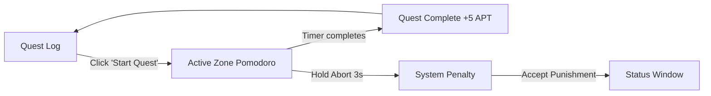
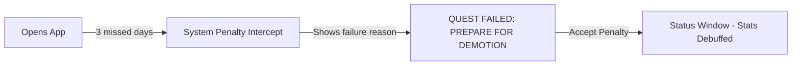
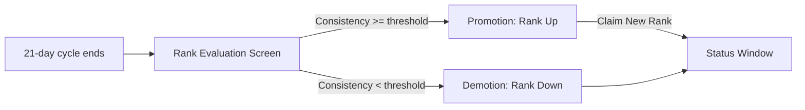
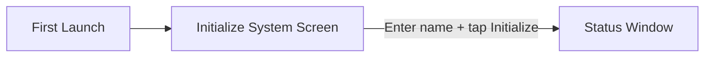

# The System Window (Dark RPG) — Complete PRD Summary

> A brutal, high-stakes habit tracker that transforms self-improvement into a life-or-death RPG. Complete daily quests to rank up; fail, and face aggressive system penalties.

**Target:** Mobile (Kotlin + Jetpack Compose)  
**Architecture:** MVVM with `StateFlow`  
**Audience:** Gamers and intense productivity seekers who respond to harsh accountability, gamification, and manhwa-style aesthetics.  
**Inspired by:** Solo Leveling (Manhwa interface), Habitica (gamification on hard mode)

---

## Table of Contents

1. [Design System](#1-design-system)
2. [Screen 1: Initialize System](#2-initialize-system)
3. [Screen 2: Status Window](#3-status-window)
4. [Screen 3: Quest Log](#4-quest-log)
5. [Screen 4: Active Zone (Pomodoro)](#5-active-zone-pomodoro)
6. [Screen 5: Active Zone (Penalty Workout)](#6-active-zone-penalty-workout)
7. [Screen 6: System Penalty](#7-system-penalty)
8. [Screen 7: Rank Evaluation](#8-rank-evaluation)
9. [Screen 8: Historical Records](#9-historical-records)
10. [Screen 9: System Config](#10-system-config)
11. [Navigation & Bottom Bar](#11-navigation--bottom-bar)
12. [Data Models](#12-data-models)
13. [Key Flows](#13-key-flows)
14. [Build Order](#14-build-order)

---

## 1. Design System

### Color Palette

| Token | Hex | Usage |
|---|---|---|
| **System Blue** (Primary) | `#2E8CFF` | Glowing borders, active states, progress fills, rank glow |
| **Void Black** (Background) | `#050507` | App background, true dark canvas |
| **Obsidian** (Surface) | `#111318` | Cards, modals, stat bar tracks (with `1px solid #1A2235` border) |
| **Frost White** (Text) | `#E2E8F0` | Primary text |
| **Slate** (Muted) | `#475569` | Inactive quests, zeroed stats, metadata |
| **Penalty Red** (Accent) | `#FF2E2E` | Failures, warnings, demotions, abort buttons |
| **Shadow Purple** (Secondary) | `#B829DF` | Earning goals, rare achievements |
| **Tertiary** (Recovery) | `#5ADACE` | Recovery/Mind category elements |

### Typography

| Role | Font | Weight | Size | Usage |
|---|---|---|---|---|
| **Headings/Numbers** | Rajdhani | 700 (Bold) | 24–48px | Ranks, timers, big stats, ALL CAPS |
| **System Alerts** | Share Tech Mono | 400 | 12–14px | Metadata, logs, timestamps, labels |
| **Body** | Outfit / Inter | 400 | 16px | Quest descriptions, readable text |
| **Buttons** | Rajdhani | 600 | 16px | ALL CAPS, 2px letter-spacing |

### Design Tokens (Kotlin)

```kotlin
// Color.kt
val SystemBlue = Color(0xFF2E8CFF)
val VoidBlack = Color(0xFF050507)
val Obsidian = Color(0xFF111318)
val FrostWhite = Color(0xFFE2E8F0)
val Slate = Color(0xFF475569)
val PenaltyRed = Color(0xFFFF2E2E)
val ShadowPurple = Color(0xFFB829DF)

// Dimens.kt / Shape.kt
val RadiusSmall = 0.dp
val RadiusMedium = 2.dp
val BorderSystem = 1.dp
```

### Design Principles (from Shadow Monarch HUD)

> [!IMPORTANT]
> **Critical Style Rules:**
> - **No border-radius.** Every corner must be `0px` (sharp) or clipped at 45°.
> - **No standard 1px borders for sectioning.** Use surface hierarchy (tonal layering) to define space.
> - **Heavy use of neon glow effects** via custom `Modifier` extensions using `drawBehind` + `Paint` + `BlurMaskFilter`.
> - **Glassmorphism** for floating modals: `surface-container` at 60% opacity + `20px` backdrop-blur.
> - **Asymmetric layouts** — place critical alerts slightly off-center for dynamic energy.
> - **Geometric, HUD-style icons** with thin strokes and sharp terminals.
> - **Clipped corners** using `clip-path: polygon(...)` for buttons and cards.

### Custom Modifiers

| Modifier | Purpose |
|---|---|
| `neonGlow(color, radius)` | Applies neon glow via `BlurMaskFilter` behind composable |
| `sharpBorder(color, width)` | Applies 0dp border-radius border |
| `deepVoidBackground(color)` | Applies the VoidBlack background |

### Stat Bar Component

- 100% width, 24px height
- Track: `Obsidian` background
- Fill: `SystemBlue` with neon glow gradient (`linear-gradient(90deg, #1A2235 → #338dfa)`)
- Labels: `Share Tech Mono`, 12px
- Shows value as `45/100` on right side
- Scanline overlay texture at `0.05` opacity

---

## 2. Initialize System

**Purpose:** Onboarding / player name registration. First screen the user sees.


### Layout
- **Full viewport** centered, no navigation bar
- Radial gradient background glow (`SystemBlue` at 8% center, transparent 70%)
- Scanline overlay at 30% opacity

### Key Elements

| Element | Details |
|---|---|
| **Top Status Bar** | Fixed. Profile avatar + "SYSTEM STATUS" title (Rajdhani, bold, blue glow). Right: `SYNCING_UID: 00-00-00` + sensor icon |
| **Protocol Label** | `Share Tech Mono`, 12px, `PROTOCOL: BOOT_SEQUENCE` |
| **Title** | Rajdhani, 30–40px, bold. `"INITIATING SYSTEM PLAYER IDENTIFICATION"` with blue text-shadow glow |
| **Input Field** | No box — bottom-line only (2px `primary-container`). Rajdhani, 30px, ALL CAPS, widest tracking. Label: `Share Tech Mono` "Subject_Designation". Placeholder: "ENTER NAME..." |
| **Keypad Grid** | 3×3 decorative grid (A1–B3) with pinging center diamond |
| **Initialize Button** | Full width, clipped-corner (bottom-right 15%), `SystemBlue` filled, black text. "INITIALIZE SYSTEM" + terminal icon |
| **Footer** | Core load bar (67%), version text: `System Sovereign v4.2.0` |

### Corner Decorations
- Top-left: `12×12` L-shaped border element (`primary`, 20% opacity)
- Bottom-right: matching mirrored element

---

## 3. Status Window

**Purpose:** The main hub showing the user's current RPG stats and rank.


### Layout
Top header → Rank Badge (upper center) → Stat Bars (middle) → Bottom Nav

### Key Elements

| Element | Details |
|---|---|
| **Header Bar** | Obsidian background, border-bottom `#1A2235`. Centered text: `"SUNG JIN-WOO | TITLE: PLAYER"` (Rajdhani, bold, widest tracking, text-shadow) |
| **Rank Badge** | 120×120px **diamond shape** (45° rotated square). Outer: `primary` border + neon-blue box-shadow. Inner: `#1A2235` border. Center text: Rank letter (Rajdhani, 48px, bold, blue glow). Below: "RANK" label (`Share Tech Mono`, 10px). Below diamond: "Status Evaluation: Stable" |
| **Stat Bars (4)** | **STR**, **APT**, **INT**, **END** — each with: label (Share Tech Mono, 12px), value/100 right-aligned (Rajdhani, 14px, blue glow), 24px bar with gradient fill + scanline overlay texture |
| **Expanded Graph** (on stat click) | Obsidian card, "30 DAY HISTORY" header, stepped bar chart, "+5% M/M" delta |
| **Earning Goal** | Purple glowing text: `"GOLD: 4,500 / 10,000"` |

### States

| State | Display |
|---|---|
| **Empty** | "NO STATS RECORDED. BEGIN QUESTS." |
| **Loading** | Glitch text effect over stats |

### Interactions
- **Click Stat Bar** → Expands to show 30-day historical line graph

---

## 4. Quest Log

**Purpose:** Daily checklist of habits organized by stat category.


### Layout
- Top: Rank & Vital HUD (rank card + Mind Sync card)
- Middle: "ACTIVE QUESTS" header + scrolling quest list
- Bottom: "INITIALIZE CUSTOM QUEST" add button + Bottom Nav

### Quest HUD Header

| Element | Details |
|---|---|
| **Rank Card** | `hud-glass` (glassmorphism), `glowing-border`, System Time label, "Rank S" (Rajdhani, 60px), "Level 88 Hunter", XP bar (94.2%) |
| **Mind Sync Card** | `hud-glass`, 88% center value, "Recovery Optimal", 5-segment indicator bar |

### Quest Item Structure

Each quest is a `hud-glass` card with `glowing-border` and a **left-4px color accent border**:

| Field | Details |
|---|---|
| **Category Icon** | Material Symbols icon in colored container (`primary/10` bg) |
| **Category Label** | `Share Tech Mono`, 10px, tracking-widest, e.g. "Strength", "Mind / Recovery" |
| **Quest Title** | Rajdhani, 20px, bold, ALL CAPS, e.g. "MUSCLE FIBER RECONSTRUCTION" |
| **Description** | Body font, 12px, max-width container |
| **Progress** | Right-aligned e.g. "60/100" or "4.2/10 KM" |
| **Action Button** | Clipped-corner button: "START TIMER", "UPDATE", "LOG", "LOCKED", "RE-SYNC" |

### Quest Categories

| Category | Border Color | Icon | Stat |
|---|---|---|---|
| **Strength** | `primary/60` | `fitness_center` | STR |
| **Intelligence** | `white/20` (locked) | `psychology` | INT |
| **Endurance** | `primary/60` | `directions_run` | END |
| **Aptitude** | `tertiary/40` | `bolt` | APT |
| **Mind/Recovery** | `tertiary/60` | `self_improvement` | Recovery |

### Quest Row (Simple View - from PRD)
- 64px height, square checkbox (1px blue border), title, stat reward (`+2 STR`)
- **Completed:** Checkbox fills `SystemBlue`, text strikethrough, haptic + UI ping
- **Swipe Left:** Reveals "SKIP" (costs 100 Gold)
- **Empty state:** "ALL QUESTS COMPLETE. STANDBY."

---

## 5. Active Zone (Pomodoro)

**Purpose:** Distraction-free, locked timer for Aptitude/Deep Work quests.


### Layout
- **Full viewport**, no navigation, status bar hidden
- Centered monolithic timer with decorative rings

### Key Elements

| Element | Details |
|---|---|
| **Header** | "System Engagement" (blue glow), "Aptitude Quest: Deep Work" (Slate, 14px) |
| **Outer Rings** | 3 concentric decorative circles (340px, 360px dashed, 300px). Crosshair markers on all 4 axes |
| **Timer Ring (SVG)** | 280×280px. Background track: Obsidian. Progress circle: `SystemBlue`, 3px stroke, depleting via `stroke-dashoffset`. Inner dashed decorative circle |
| **Timer Text** | **80px** Rajdhani (Space Grotesk in mockup), bold, `SystemBlue` with heavy `text-shadow` glow. Colon pulses (`animate-pulse`). "Sync Active" indicator below |
| **Abort Button** | Bottom center. Red border (20% opacity), red text: "ABORT QUEST" + warning icon. Subtext: "(Incurs Penalty)". "Hold 3s to override" hint above |

### States

| State | Behavior |
|---|---|
| **Running** | Timer counts down, ring depletes, "Sync Active" pulses |
| **Completed** | Screen flashes blue: "QUEST COMPLETE. +5 APT." |

### Interactions
- **Hold Abort Button (3s)** → Red progress fill animation → triggers failure → transitions to System Penalty

---

## 6. Active Zone (Penalty Workout)

**Purpose:** Forced workout timer when a penalty protocol is active.


### Layout
- **Full viewport**, no escape — penalty lockdown mode
- Header with "System Override" / "Penalty Active" labels

### Key Elements

| Element | Details |
|---|---|
| **Title** | "PENALTY PROTOCOL: WORKOUT" (Rajdhani, 30–50px, red glow `text-shadow`) + "Status: Severe Violation Detected" |
| **Central Timer** | 72–96pt central timer "24:59" (heavy glow). Aggressive pulse ring (red, `pulse-red` keyframe). Rotating segment decoration (10s linear spin). Inner ring borders. 3-dot severity indicator |
| **Bento Grid** | 3-column task cards: **Cardio Intensity** (185 BPM, progress bar), **Pushups Target** (12/50, red progress), **Lockdown State** (ALL FEATURES OFFLINE) |
| **Actions** | "Report Completion" (red filled, clipped-corner), "Emergency SOS" (blue border, outline) |
| **Footer** | Network connection indicator, power reserve (88%), failure penalty: `QUEST_SUSPENSION_48H` |

---

## 7. System Penalty

**Purpose:** Aggressive failure notification when dropping a streak or aborting a quest.


### Layout
- Full screen overlay with heavy red ambient glow
- Glitch scanline background texture

### Key Elements

| Element | Details |
|---|---|
| **Alert Badge** | Red border-x badge: "System Alert" (Share Tech Mono, red) |
| **Title** | "PENALTY OVERRIDE" (Rajdhani, 60–80px, white + red span, red `text-shadow` glow) + "STATUS: ACTIVE" |
| **Penalty Timer Card** (large, 2-col span) | "REMAINING_TIME" label, "PENALTY TIMER" heading, **"23:59" timer** (Share Tech Mono, 70–90px), deadline text in red |
| **Required Tasks Card** | Red left-4px border. Task list: Workout (30m), Meditation (15m), Study (45m) |
| **Accept Button** | Full width, `PenaltyRed` bg, black text, clipped-corner: "ACCEPT PUNISHMENT". Red neon `box-shadow` glow (30px→50px on hover) |

### States
- **PRD original:** "SYSTEM ALERT" flashing, "QUEST FAILED: PREPARE FOR DEMOTION", penalty result: "-1 RANK. -10 STR."
- **Click Accept** → Dismisses modal, routes to Status Window with red hit-flash animation

---

## 8. Rank Evaluation

**Purpose:** Status screen showing promotion or demotion based on 21-day cycles.


### Layout
- Full viewport, centered, no bottom nav visible
- Background: 40px grid pattern, scanline overlay effect

### Key Elements

| Element | Details |
|---|---|
| **Header Badge** | "System Message" neon-blue bordered badge |
| **Title** | "Evaluation Complete" (30px, bold, glitch animation). "Cycle 04 Finalized" subtitle |
| **Rank Transition** | "Promotion Achieved" label. Shows: `C-RANK` (Slate, strikethrough) → arrow → `B-RANK` (Frost White + blue glow, scaled up). Decorative nested diamond shapes behind |
| **Consistency Card** | Neon-blue border, left-1px blue accent. Rate: 92%, progress bar, "Quests: 61/63", "Penalties: 0" |
| **Attribute Adjustments** | 2×2 grid: STR +15, APT +10, INT +5, END +8 (mono font, blue values) |
| **CTA** | "Claim New Rank" — blue border, hover fills blue. Slide-fill animation on hover |

---

## 9. Historical Records

**Purpose:** Analytics dashboard showing stat progression over time.


### Layout
- 12-column grid: 8-col charts + 4-col radar/notifications
- Tab bar: Weekly / Monthly / Yearly

### Key Elements

| Element | Details |
|---|---|
| **Growth Vector Chart** | Stepped bar chart (not curves), 7 bars for days, primary color fills with hover tooltips ("LVL UP"), legend: STR (primary), APT (tertiary), INT (secondary) |
| **Mini Stat Cards** | 3-column: Peak Endurance (142, +12.4%), Sync Probability (88.4, STABLE), Penalty Risk (0.02, LOW) |
| **Radar Chart** | Pentagon shape, 3 nested polygons (10%/20%/30% opacity), active data polygon at 80% scale with pulse animation. Axes: STR, APT, INT, END, SPD |
| **System Notifications** | Log feed: `[UPDATE]` tertiary-bordered, `[LOG]` primary-bordered, `[SYNC]` muted |
| **CTA** | "Initialize Deep Scan" clipped-corner blue button |

---

## 10. System Config

**Purpose:** Settings and system preferences management.


### Layout
- Rank progression HUD at top
- 2-column configuration grid
- System toggles section

### Key Elements

| Element | Details |
|---|---|
| **Rank Progression** | "RANK: B+" (Rajdhani, 30px, italic), "Evolution Cycle 14/21 DAYS", 5-segment progress bar (3 filled) |
| **Active Penalties** | Side card: "Sleep Deprivation: -5% AGI" (warning icon, red), "No active task failures" (check, faded). "CLEAR PENALTIES" red button |
| **Aptitude Timer** | Duration slider (15–120 min, step 15), current: 45 min. Warning about Mental Fatigue risk |
| **Underling Sync** | Sub-System Alpha (CONNECTED, pulsing link icon), Beta (OFFLINE, link_off). "Initialize New Protocol" button |
| **System Toggles** | Custom switch toggles for: Notifications (ON), Watch Sync (ON, glowing), Aggressive HUD Overlay (OFF), Auto-Save Protocols (ON) |
| **Data Export Banner** | Hero image card: "Evolution Data Log" with download icon pulse on hover |

---

## 11. Navigation & Bottom Bar

### Bottom Navigation Bar

| Tab | Icon | Label | Destination |
|---|---|---|---|
| **Status** | `person_pin` / `account_circle` | STATUS | Status Window |
| **Quests** | `assignment_late` | QUESTS | Quest Log |
| **Stats** | `bar_chart` / `query_stats` | STATS | Historical Records |
| **Config** | `settings_input_component` / `settings_suggest` | CONFIG | System Config |

**Active State:** `SystemBlue` color, `drop-shadow` glow, `scale-110`, filled icon variant, top `2px` border indicator  
**Inactive State:** `Slate` color (600), grayscale filter, 50% opacity  
**Bar Style:** Fixed bottom, `VoidBlack/80%` + `backdrop-blur-2xl`, `0.5px` top border `blue-500/20`, negative shadow upward

### Screens Without Bottom Nav
- **Initialize System** (onboarding)
- **Active Zone Pomodoro** (locked full-screen)
- **Active Zone Penalty** (lockdown mode)
- **Rank Evaluation** (modal/overlay)

---

## 12. Data Models

### Player

```kotlin
data class Player(
    val name: String = "Player",
    val title: String = "Unranked",
    val rank: Rank = Rank.UNRANKED,
    val stats: Stats = Stats(),
    val gold: Gold = Gold()
)
```

### Rank

```kotlin
enum class Rank {
    UNRANKED, K, J, I, H, G, F, E, D, C, B, A, S
}
```

> [!NOTE]
> K-Rank through A-Rank represent levels 0–9 (alphabetical).  
> S-Rank is the max rank. Reaching S-Rank unlocks the progression path to the ultimate **"Shadow Monarch"** title, which requires leveling through 10 distinct zones within S-Rank (representing 18 months of consistency).
> Unranked displays as "PLAYER".

### Stats

```kotlin
data class Stats(
    val strength: Int = 0,
    val aptitude: Int = 0,
    val intelligence: Int = 0,
    val endurance: Int = 0
)
```

### StatType

```kotlin
enum class StatType {
    STRENGTH, APPTITUDE, INTELLIGENCE, ENDURANCE
}
```

### Quest

```kotlin
data class Quest(
    val id: Int,
    val title: String,
    val description: String = "",
    val statType: StatType,
    val reward: Int = 0,
    val isCompleted: Boolean = false,
    val isAutoSync: Boolean = false,
    val isSkipped: Boolean = false
)
```

### Gold

```kotlin
data class Gold(
    val current: Int = 0,
    val target: Int = 10000
)
```

---

## 13. Key Flows

### Flow 1: Initiating an Aptitude Quest



### Flow 2: Facing a System Penalty



### Flow 3: Rank Evaluation (21-day cycle)



### Flow 4: System Initialization



---

## 14. Build Order

| Phase | Task | Key Details |
|---|---|---|
| **1** | Design System Setup | `Color.kt`, `Type.kt`, custom `NeonGlowModifier`, `Shape.kt` tokens. Download & register Rajdhani, Share Tech Mono, Outfit fonts |
| **2** | Status Window | `StatusWindowScreen` composable, reusable `StatBar` with animated fills, `RankBadge` diamond shape, `EarningGoal` |
| **3** | Quest Log | `LazyColumn` layout, `QuestRow` with custom checkboxes, `SwipeToDismissBox` for skip, category headers |
| **4** | Active Zone (Pomodoro) | Centered timer, `Canvas` ring animation, `StateFlow`-driven countdown, DND activation, hold-to-abort gesture |
| **5** | System Penalty | Full-screen `Dialog` overlay, flashing red animation, penalty result display, accept button triggers stat debuff |
| **6** | Rank Evaluation | Promotion/demotion display, attribute adjustment summary, claim button |
| **7** | Historical Records | Stepped chart visualization, radar chart, notification feed, time range tabs |
| **8** | System Config | Settings toggles, timer slider, underling sync, data export |
| **9** | Initialize System | Onboarding flow, name input, animate-in sequence |
